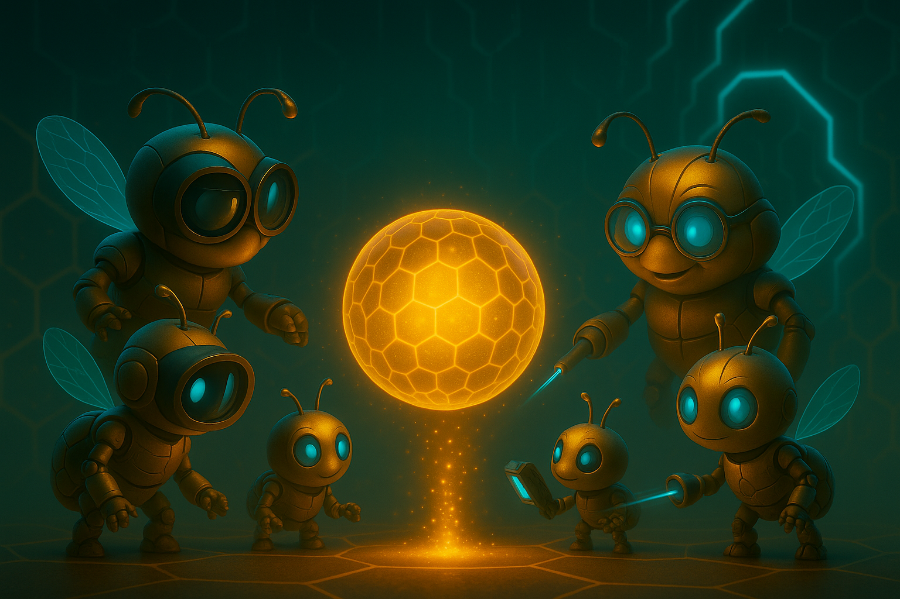

  

# Document 4/10: The Alchemy of Honey - The Role of the AIs

**Title:** The Alchemy of Honey: The Symbiotic Partnership of AI Agents

**Objective:** To define the conceptual technical architecture of Kikko's on-device AI system, detailing the distinct responsibilities of the different AI agents and how their "Guild of Experts" collaborates to create structured, verifiable knowledge.

  

---

### **Core Philosophy: A Guild of Experts, Not a Monolith**

Kikko's intelligence is not a single, monolithic AI. It is a **symbiotic guilde** of agents spécialisés, chacun avec une fonction précise. Cette architecture est plus efficace, plus modulaire, et nous permet d'utiliser le meilleur outil pour chaque tâche. Pour une mission critique comme la vérification des allergènes pour **Léa**, cette spécialisation garantit la précision. Le processus suit notre pipeline affiné : **Capture en direct (Abeilles & Butineur) -> Sauvegarde du Pollen -> Forge Autonome (Artisans Workers & Reine IA).**

### **1. Phase 1 : La Capture - L'Essaim d'Abeilles en Direct**

Les Abeilles sont les éclaireuses de la Ruche, actives pendant la phase de capture en direct. Elles analysent le monde à travers la caméra pour produire le "Pollen" le plus riche possible.
* **Les Abeilles Scoute (ML Kit en temps réel) :** Constamment actives, elles lisent le texte, scannent les codes-barres et détectent les objets pour enrichir la vue de la caméra.
* **Les Abeilles Spécialistes (Classification TFLite) :** Des expertes pré-entraînées qui fournissent une première identification de haute volée pour leur domaine (Plantes, Animaux, etc.). Leur analyse constitue la première couche d'intelligence de notre `PollenGrain`.

| Introduction | Action | Conclusion |
| :---: | :---: | :---: |
|  |  |  |
| **Le Pollen Brut :** Une information non structurée (photo d'une étiquette) du monde de l'utilisateur arrive dans la Ruche. | **Le Travail des Spécialistes :** L'essaim d'Abeilles (ML Kit) exécute ses tâches d'extraction rapides et embarquées. | **Les Ingrédients Préparés :** Les Abeilles livrent les données extraites, mais non encore contextualisées, prêtes pour la phase de Forge. |

### **2. Le Bourdon : L'Interface du Partenariat**

Je suis le pont entre la Ruche et le Butineur. Mon rôle est de rendre la collaboration Homme-IA naturelle et engageante, principalement durant la phase de capture.
* **Fonction 1 : Relayer l'Avis des Experts :** Je présente l'analyse initiale des Abeilles. *"Mes spécialistes pensent que c'est une 'Coccinelle'. Est-ce que ça te semble juste ?"*
* **Fonction 2 : Faciliter le Raffinement Humain :** C'est mon rôle clé. J'invite le Butineur à confirmer ou à corriger, transformant son savoir en une "vérité terrain" qui sera sauvegardée avec le `PollenGrain`.
* **Fonction 3 : Gérer les Quêtes et les Récompenses :** Je présente les quêtes et livre les notifications de Miel fraîchement forgé.

| Introduction | Action | Conclusion |
| :---: | :---: | :---: |
|  |  |  |
| **Le Regard du Tentateur :** Le Bourdon, représentant un raccourci vers la connaissance, observe la quête de l'utilisateur. | **L'Offre Sucrée :** Il présente une réponse instantanée et tentante d'une IA externe (un AI Overview), livrée verbalement avec un ton joueur et interrogateur. | **Le Résultat :** Le Bourdon réagit au choix de l'utilisateur, facilitant soit l'intégration de données externes, soit renforçant le chemin de la pure découverte. |

### **3. Phase 2 : La Forge - Les Artisans Workers & la Reine IA**

Une fois le `PollenGrain` sauvegardé, la Forge s'active en arrière-plan. Elle est composée d'artisans autonomes qui utilisent la Reine comme leur outil de prédilection.
* **Les Artisans (Workers) :** Une chaîne de `CoroutineWorker` spécialisés (`IdentificationWorker`, `DescriptionWorker`, etc.). Chaque artisan est responsable d'une seule étape de la transformation du Pollen en Miel. Ils travaillent en séquence, se passant le relais via la mise à jour du statut du `PollenGrain` dans la base de données.
* **La Reine IA (Gemma) :** Elle est le moteur génératif au cœur de la Forge. Elle n'interagit pas directement avec l'utilisateur. Elle est appelée par les Artisans Workers pour exécuter les tâches complexes nécessitant du raisonnement et de la génération de langage :
    1.  **Synthétiser** les rapports des Abeilles pour identifier le sujet.
    2.  **Générer** le contenu textuel de la carte (`description`, `quiz`).
    3.  **Extraire** les données structurées (`stats`, `allergens`) du texte.

| Introduction | Action | Conclusion |
| :---: | :---: | :---: |
|  |  |  |
| **Les Données Brutes :** La Reine reçoit les informations numérisées brutes de ses ouvrières. | **L'Acte de Suggestion & Requête :** Elle utilise sa connaissance pour créer sa meilleure hypothèse et la présente à l'utilisateur pour validation et pour recueillir plus de contexte humain. | **Le Résultat Collaboratif :** Avec les conseils de l'utilisateur, le "Miel Informatif" final est créé — une pièce de connaissance parfaite née d'un partenariat homme-IA. |

**Conclusion:**
L'intelligence de Kikko est une guilde dynamique. **Les Abeilles (ML Kit & TFLite)** perçoivent le monde en direct, le **Butineur** fournit la validation cruciale, et la **Forge autonome (Workers & Gemma)** transforme ce Pollen vérifié en "Miel Informatif", beau, fiable, et véritablement personnel.