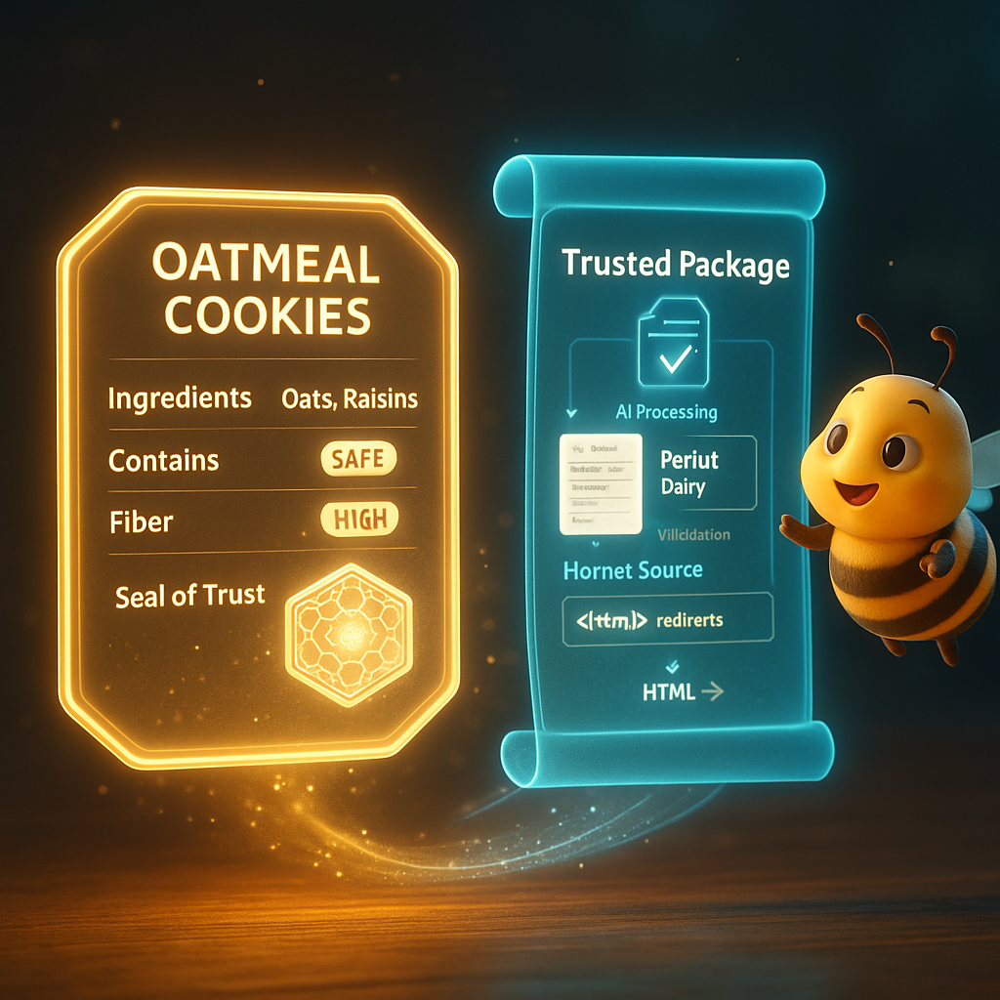

<p align="center">
  
</p>

# Document 6/10: The Thread of Provenance - The Seal of Trust

**Title:** The Thread of Provenance: The Unbreakable Seal of a Customizable and Verifiable AI

**Objective:** To detail the structure and purpose of the Provenance Log, positioning it as the core innovation that enables radical transparency, trust, and the evolution of a user-customizable AI.
<p align="center">
  
</p>
---

### **Core Philosophy: The Story is the Proof**

In an age where AI can provide any answer, the answer itself loses value. The new value lies in its **origin story**. In Kikko, the "Informative Honey" is useful, but its true power comes from the verifiable story of its creation. The **Thread of Provenance** is that story.

It is not just metadata; it is a "Seal of Trust," the tangible proof that a piece of knowledge was born from a transparent, reproducible, and now **customizable** human-AI partnership. It is the definitive answer to the question: *Why should I trust this memory, and how can I be sure the AI reasoned as I intended?* For **Léa**, this isn't a philosophical question; it's a matter of safety. The Thread of Provenance shows her *exactly* how her customized Hive determined a food was safe.

### **1. The Structure of the "Thread of Provenance"**

The Thread of Provenance is a detailed JSON document stored with each `KnowledgeCard`. Il documente la **chaîne de production autonome** qui a transformé un `PollenGrain` en Miel.

* **A. La Matière Première (`pollenGrain`):** Le log commence par une copie du `PollenGrain` original qui a servi de base. C'est la preuve de la matière première utilisée.
    *   `"pollenGrain": { "id": "...", "timestamp": ..., "userIntent": "...", "pollenImagePaths": [...], "swarmAnalysisReportJson": "{...}" }`

* **B. Le Journal de la Forge (`forgeLog`):** Un log de chaque étape exécutée par nos **workers autonomes**. C'est le **plan de reproduction d'inférence**.
    * **Exemple d'entrée pour le `DescriptionWorker`:**
        ```json
        {
          "timestamp": "...",
          "worker": "DescriptionWorker",
          "action": "ContentGeneration_Description",
          "facets": {
              "modelExecution": { 
                  "modelName": "Gemma 3 1B",
                  "promptSetId": "kikko_default_prompts_v1.2", 
                  "prompt": "Write a descriptive paragraph about \"Plant - Dandelion\"...",
                  "rawResponse": "The dandelion is a common wildflower..." 
              },
              "inferenceParameters": {"temperature": 0.2}
          }
        }
        ```

* **C. Le Nid du Frelon (`hornetLog`):** Si des données externes ont été incluses dans le `PollenGrain` initial, cette section fournit le contexte pour la **traçabilité**.
    *   `{ "timestamp": "...", "action": "HornetOfferAccepted", "sourceUrl": "...", "savedHtmlReference": "hornet/dandelion_overview.html" }`

| Introduction | Action | Conclusion |
| :---: | :---: | :---: |
|  |  |  |
| **The Seal of Trust:** Every piece of knowledge is automatically stamped with an unforgeable seal, signifying its transparent history. | **Unfolding the Story:** The user can inspect this seal, revealing the complete journey of the data's creation, from raw input to final structure, separating reproducible Hive logic from traceable Hornet sources. | **The Trusted Package:** The final data and its provenance are intrinsically linked, creating a single, verifiable unit of knowledge ready for use or sharing. |

### **2. The Role in Gameplay: The Ultimate Prize**

The Thread of Provenance is the soul of the reward system, distinguishing levels of trust within the knowledge itself.
* **The Mark of the Hornet:** Data integrated from a Hornet's AI Overview is **traceable** to its source HTML but not **reproducible**. It's marked with a grayish tint. For Léa, this means "This information is from the web, use with caution for allergy decisions."
* **The Seal of the Forager:** Data forged à partir d'un `PollenGrain` pur reçoit le **Sceau de Confiance** doré. C'est entièrement **reproductible** car son `forgeLog` est complet. For Léa, this means "This information has been verified by your Hive, based on your input. You can trust it." It grants the highest rewards and unlocks advanced features.

### **3. The Impact on Sharing: The Gift of Verifiable Trust**

When a Forager shares a `KnowledgeCard` object, they are gifting a complete, self-contained package of knowledge, including its detailed Thread of Provenance. This enables our core innovation:

**True Inference Reproduction.**

A parent receiving a "SAFE" food `Card` for their allergic child doesn't just have to take the sender's word for it. Their own Kikko Hive can automatically parse the sender's `provenanceLog`, **download the specified prompt set if they don't have it**, extract the exact prompt and parameters for each step, re-run the same inferences on its own local models using the original source image, and compare the output to a cryptographic hash of the original output. This is trust, but with mathematical proof. This moves us from a world of "black box" data to a world of **"glass box" data**, where the process of creation is as important as the result, and is fully verifiable by anyone in the community.
**Conclusion:**
The Thread of Provenance is the soul of Kikko. It transforms the app from a clever data-capture tool into a powerful statement on information integrity and personal agency. It is the mechanism that gives weight and meaning to the Forager's choice, providing not only the power to remember, but the profound satisfaction of knowing that their memories are pure, their history is intact, and their knowledge is verifiably real through **inference reproduction** and transparent sourcing.