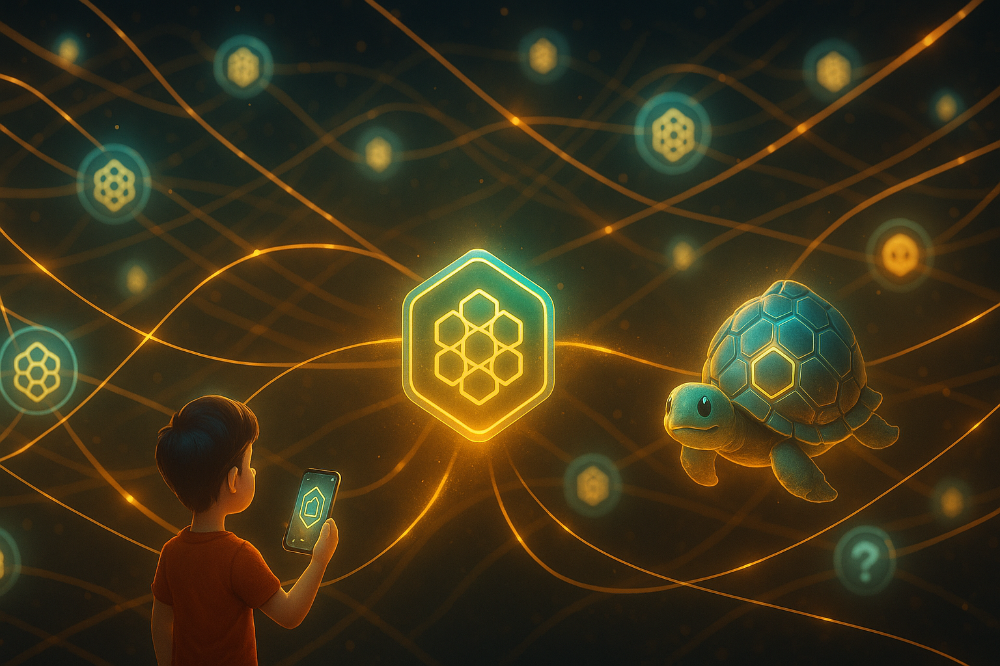

  

# Document 10/10: The Kikko Project - Synopsis for the Google AI Edge Challenge

**Title:** Kikko's Saga Forge: A Verifiable & Evolvable Knowledge Game Built on Trust

**Objective:** To provide a comprehensive summary of the Kikko project for the Google AI Edge Challenge, highlighting its innovative concept, its sophisticated use of Google's on-device AI to tackle a modern-day dilemma, and its profound potential for real-world impact through a fully customizable AI architecture.

  

---

### **1. High-Concept Pitch**

In an age where AI offers instant but opaque answers, **Kikko's Saga Forge** introduces a new genre: the **Verifiable & Evolvable Knowledge RPG**. It reframes the smartphone not as a window to the cloud, but as a private, intelligent **Memory Hive** whose very logic can be shaped by the user. In a **true human-AI partnership**, you (the **Forager**) capture high-quality "Pollen" from your world, which is then entrusted to an **autonomous, on-device Forge**. This Forge, a chain of intelligent workers powered by the **AI Queen (Gemma)**, transforms your pollen into trusted knowledge in the background. Our core innovations are the **"Thread of Provenance"**, a log that makes every inference **verifiably reproducible**, and a **Dynamic Prompting System**, which allows the entire AI logic to be modified by the user, turning the AI from a black box into a living, adaptable glass box.

### **2. The Vision & Impact (40 Points)**

Kikko's vision is to combat **assisted digital amnesia** by empowering individuals with **sovereignty over their digital memory and the very AI that helps them forge it.**
* **Tackling a Modern Dilemma: The Hornet's Temptation.** Kikko gamifies the "convenience vs. truth" problem. It presents a choice between enriching your captured Pollen with opaque "AI Overviews" from external sources (the "Hornet's Offer") and the rewarding effort of collecting pure, verifiable Pollen for your autonomous Forge. This subtly educates users on digital literacy and the critical importance of **inference reproduction**.
* **A New Paradigm for Personal AI: The User as AI Trainer.** The AI Queen (Gemma) doesn't just answer, she is the engine of a background factory. Our architecture allows users to **edit the prompts** that the factory workers use, or **download new "personality packs"** from the community, making them active participants in their AI's evolution.
* **Radical Privacy, Trust & Evolvability:** With a **100% on-device architecture**, all user data and AI models remain private. The "Thread of Provenance" includes a version hash of the prompt sets used for an inference, making even a **customized AI's reasoning fully reproducible**.
* **A Gift to the Community: Non-Commercial Vision.** Kikko is a **non-commercial project**, offered entirely free. Its sole focus is on impact and demonstrating a viable, ethical, and community-driven model for personal AI.

| Introduction | Action | Conclusion |
| :---: | :---: | :---: |
|  |  |  |
| **Individual Sovereignty:** Kikko empowers each user with complete control over their digital memory, securing it within their personal device and making it verifiable. | **The Conscious Choice:** The core gameplay loop is a continuous test where Hiro chooses authentic, personally forged knowledge over convenient, opaque external data. | **Collective Resilience:** This model fosters a decentralized community, creating a more private and equitable web of shared, trusted, and reproducible knowledge. |

### **3. Technical Depth & Execution (30 Points & Google AI Edge Prize)**

Kikko is a sophisticated showcase of how Google's on-device technologies can be orchestrated to create a novel, privacy-first, and user-modifiable experience.
* **The Autonomous Forge (Multi-Worker Chained Inference):**
    1.  **Live Capture (ML Kit & TFLite):** An on-device "Swarm" of **Specialist Bees** analyzes the camera feed in real-time. The user captures this rich data as a `PollenGrain` and saves it locally.
    2.  **Forge Activation (`WorkManager`):** The saving of a `PollenGrain` triggers a persistent, unique chain of background workers.
    3.  **Sequential Forging:** Five specialized `CoroutineWorker` classes (`IdentificationWorker`, `DescriptionWorker`, etc.) execute in sequence. Each worker picks up the job where the previous one left off, fetching the data from the local SQL database, performing its task, and updating the database for the next worker.
    4.  **Generative Engine (Gemma):** Each worker uses the **AI Queen (Gemma)** as its generative engine, calling it with specific prompts to perform its task (e.g., generate a description, extract stats). This happens entirely in the background, respecting user-defined constraints (charging/idle).
    5.  **Inference Reproduction Blueprint:** Each worker logs its specific action—including the **ID of the prompt set used**—within the "Thread of Provenance," creating a verifiable blueprint for other Hives to reproduce the entire chain of inferences.
* **The Architecture of Trust & Digital Pollination:**
    * **Core App & UI:** Built on Android (Kotlin) with a pure SQL persistence layer for maximum control and performance.
* **Local P2P:** **Google Nearby Connections** for offline discovery and battle initiation.
* **Remote Decentralized Sharing:** **WebTorrent** integrated for secure, P2P sharing of "Trusted Packages" (the `KnowledgeCard` object with its full `provenanceLog` and source images) via QR codes.
    * **Dynamic Asset Loading:** The application is designed to load its core AI logic (`prompts.json`) and game content (`clash_questions.json`) from local files, which can be updated from a remote server (`kikko.be`) without requiring an app update. This allows for continuous improvement and community-driven content expansion.

| Introduction | Action | Conclusion |
| :---: | :---: | :---: |
|  |  |  |
| **1. Initial Extraction:** As raw pollen enters the Hive, Worker Bees (ML Kit) begin meticulous on-device processing. | **2. The Bourdon's Offer:** Simultaneously, the Bourdon delivers an instant, pre-packaged "AI Overview" (from a local WebView search) as a tempting shortcut. | **3. The Forger's Path:** If the user chooses authenticity, the AI Queen (Gemma) forges verifiable knowledge in partnership with them, culminating in a pristine "Seal of Trust". |

### **4. Video Pitch & Storytelling (30 Points)**

Our 5-minute animated short film, **"Hiro's Choice,"** will bring the core dilemma to life, showcasing the problem of fleeting memory, the magic of the human-AI partnership, the temptation of the Hornet's offer, and the profound satisfaction of having an **autonomous Forge** create verifiable truth. The video will visually explain the revolutionary concept of **Inference Reproduction** and highlight the long-term utility of having a proactive, trusted, and **personally customizable** AI companion.

**Conclusion:**
Kikko is more than an application; it is a timely and necessary response to the evolution of AI. By masterfully combining the on-device power of **Gemma** and **specialized TFLite models** within an engaging, gamified, and ethically-uncompromising framework, Kikko doesn't just showcase what the technology can do—it makes a powerful statement about how it *should* be used to create a truly personal and evolvable AI built on verifiable, reproducible knowledge.