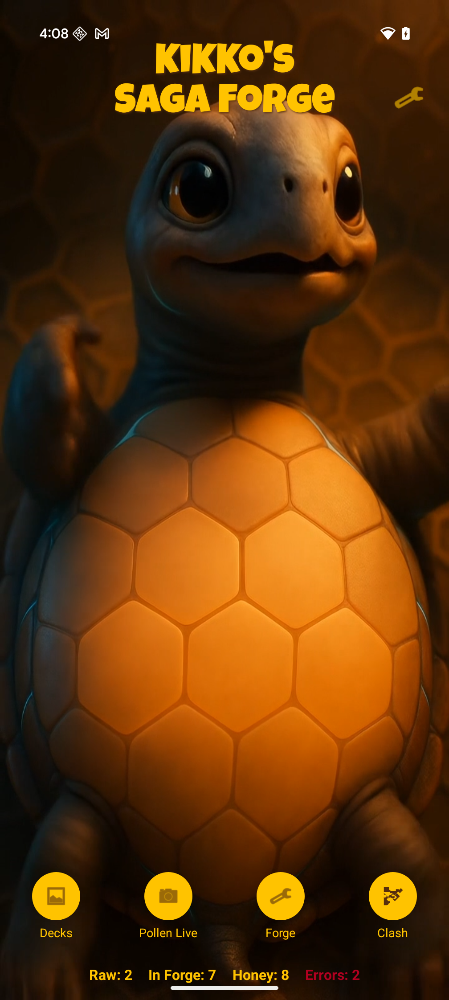
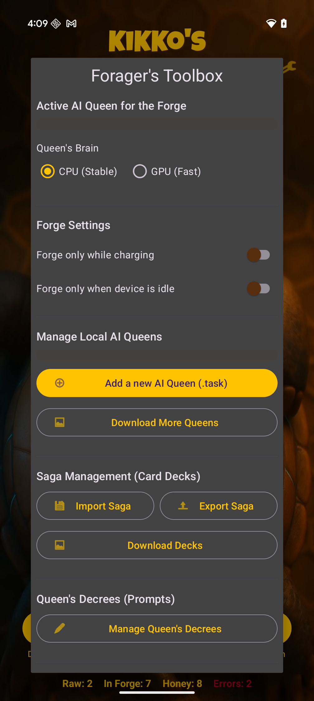
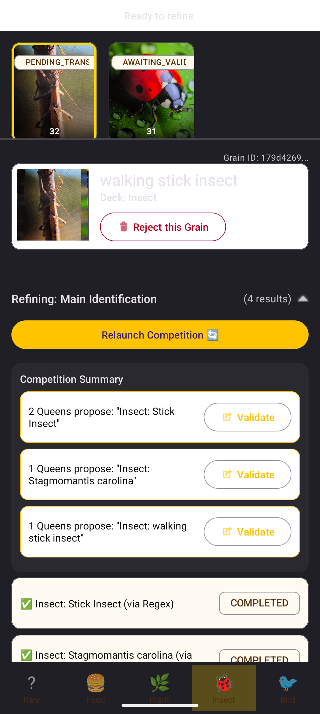
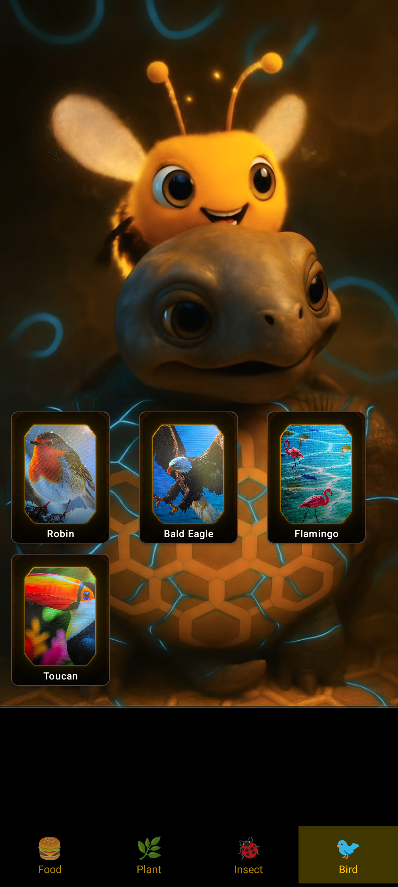
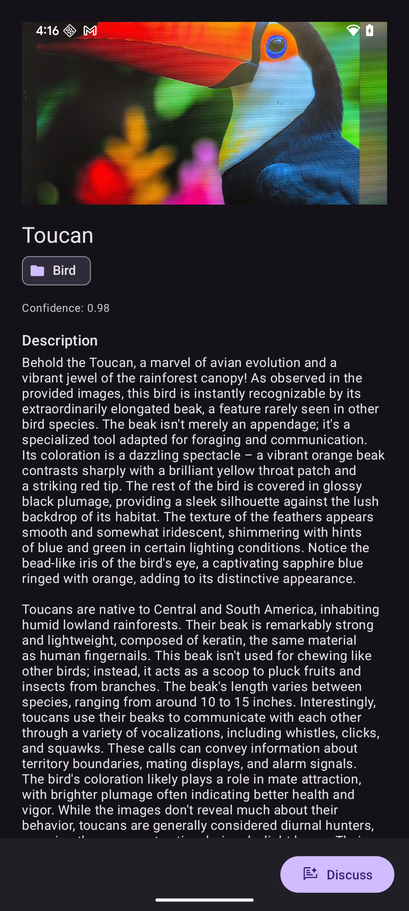
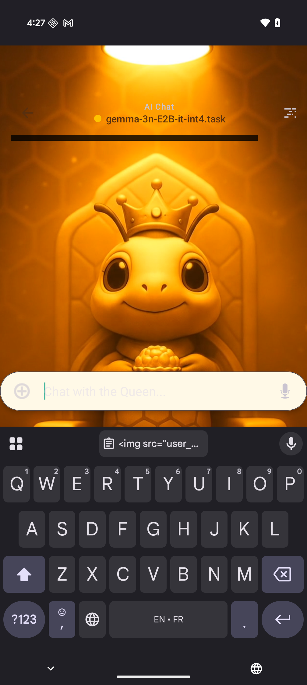
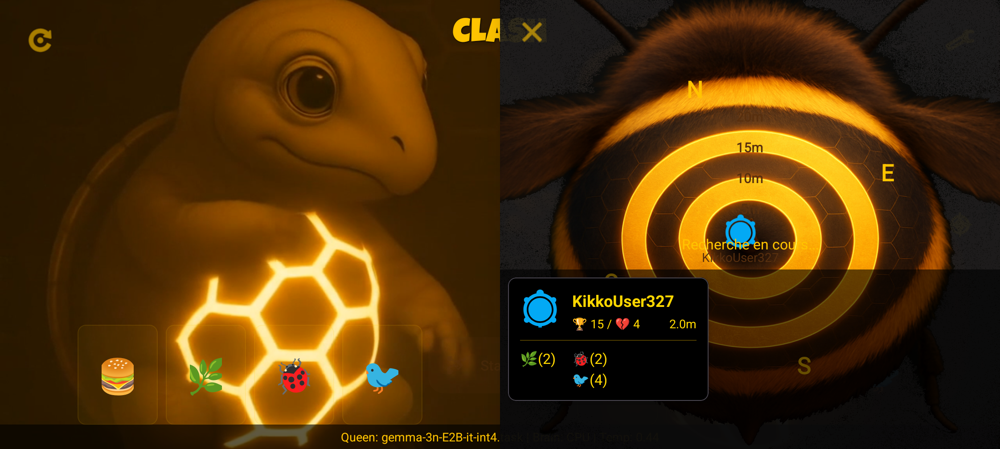
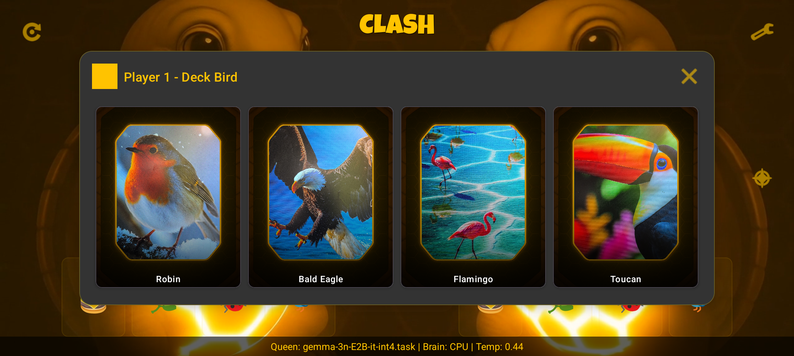
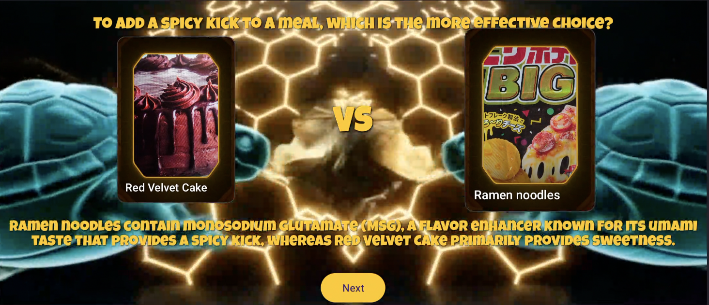

# Kikko’s Saga Forge — User Guide

> **Version**: 1.0 (draft)
> **Platform**: Android (offline, on‑device)

---

## Table of Contents

1. [About](#about)
2. [Install](#install)
3. [First Launch & Permissions](#first-launch--permissions)
4. [Home (Start)](#home-start)
5. [Tools Menu](#tools-menu)
6. [Live Forge (Camera)](#live-forge-camera)
7. [Forge Workshop](#forge-workshop)
8. [Cards & Decks](#cards--decks)
9. [Royal Audience (AI Chat)](#royal-audience-ai-chat)
10. [Prompt Editor](#prompt-editor)
11. [Clash Arena (Duels)](#clash-arena-duels)
12. [Import/Export Saga (.kikkoSaga)](#importexport-saga-kikkosaga)
13. [Local AI Models](#local-ai-models)
14. [Quick Troubleshooting](#quick-troubleshooting)

---

## About

**Kikko’s Saga Forge** is a verifiable‑knowledge RPG. You capture **raw pollen** (camera input like labels, barcodes, objects), the on‑device AI **forges** it into collectible **knowledge cards**, then you play, revise, and share — all **offline** after resources are installed.

---

## Install

* Download the APK from the repository’s README link.
* Allow installs from your browser/file manager if prompted.
* Open the APK to install, then launch the app.

---

## First Launch & Permissions

The app may request: **Camera**, **Microphone** (if speech-to-text), **Notifications**, **Nearby Devices**/**Bluetooth** (P2P Clash), **Approx Location** (Clash radar). Grant only what you plan to use.

---

## Home (Start)

Four primary buttons: **Kikko (Decks)**, **Pollen (Live)**, **Forge (Workshop)**, **Clash**. Top‑right: **Tools** (gear). Counters show **Raw Pollen**, **In Forge**, **Total Honey (cards)**, **Errors**.

**Hidden tip**: press‑and‑hold (\~1s) the **turtle belly** area near the bottom center for a small animation.

---

## Tools Menu

From the **gear** icon:

* **Import/Export a Saga** (.kikkoSaga)
* **Add/Remove an AI model** (.task)
* **Manage Prompts** (open the editor)
* **Nuke the hive** (reset local DB)

---

## Live Forge (Camera)

Camera mode to capture **raw pollen**. An overlay draws detections (OCR text boxes, object labels, barcodes). Each capture creates a **Pollen Grain** queued for the Forge pipeline.

---

## Forge Workshop

Dashboard of **grains** and their **status**:

* **RAW** → **IDENTIFYING** → **PENDING\_DESCRIPTION** → **PENDING\_STATS** → **PENDING\_QUIZ** → **PENDING\_TRANSLATION** → **HONEY (card)**
* **ERROR** if a step failed (you can retry).

---

## Cards & Decks

**Kikko (Decks)** opens the gallery by deck (**Food**, **Plant**, **Insect**, **Bird**). Tap a card for details: image, description, attributes, tags, and actions (**Quiz**, **Translate**, **Delete**).

---

## Royal Audience (AI Chat)

Chat with the **Queen** (on‑device LLM):

* **Model** button to choose a **.task** file
* **Settings** (Temperature, Top‑K)
* You can **attach an image** for contextual grounding

---

## Prompt Editor

Browse prompt keys, **edit**, **save**, **import/export** a JSON, or **restore defaults**.

---

## Clash Arena (Duels)

Pick a **mode** (Solo / P2P), choose your **champions** (cards by deck), then start the **duel**. For P2P, use the **radar** to discover the opponent, **accept** the connection, and play.

---

## Import/Export Saga (.kikkoSaga)

* **Export**: creates a `.kikkoSaga` archive (cards + images + analyses) and opens the Android **share sheet**.
* **Import**: pick a `.kikkoSaga`; **new** cards are **grafted** without name duplicates.

---

## Local AI Models

* **Add a model**: pick a **.task** → appears in local models list.
* **Remove**: delete from the local list.
* **Vosk (voice)**: import a **.zip** speech model; it installs into the local folder and becomes available in **Royal Audience**.

---

## Quick Troubleshooting

* **Welcome video pauses when app is backgrounded**: expected (Android pauses playback on activity pause).
* **ERROR status in Workshop**: retry the failed step or delete the grain.

---
