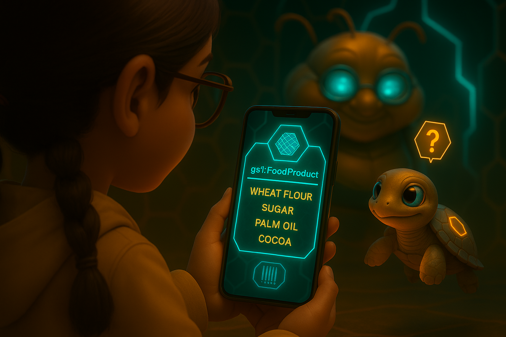

  

# Kikko's Saga Forge: A Verifiable & Evolvable Knowledge RPG

**"Forgez votre saga vérifiable avec une IA embarquée. Un nouveau jeu pour combattre l'amnésie digitale et restaurer la confiance dans l'IA."**

---

### **1. La Vision : Une Réponse à la Crise de Confiance de l'IA**

Ce document sert de vérification technique pour notre soumission au Google Gemma 3n Impact Challenge. Il détaille l'architecture de Kikko's Saga Forge, un nouveau **"Jeu de Connaissance Vérifiable & Évolutif"** conçu comme une application Android 100% embarquée et respectueuse de la vie privée. Nous expliquons notre utilisation spécifique et multifacette du modèle Gemma 3n, soulignons les défis d'ingénierie importants surmontés — en particulier pour garantir la robustesse de l'IA et la résilience du système — et justifions les choix techniques qui font de notre vision une réalité fonctionnelle. Ce document prouve que notre démonstration vidéo est soutenue par une ingénierie délibérée et concrète.

*   [**Document 10: Le Synopsis pour le Concours Google**](./doc/doc10.md)

| Le Dilemme | Le Processus | La Récompense |
| :---: | :---: | :---: |
|  |  |  |
| **Souveraineté Individuelle :** Kikko donne à chaque utilisateur un contrôle total sur sa mémoire numérique, la sécurisant sur son appareil et la rendant vérifiable. | **Le Choix Conscient :** La boucle de gameplay principale est un test continu où l'utilisateur choisit la connaissance authentique et forgée personnellement plutôt que les données externes pratiques mais opaques. | **La Saga Vivante :** La récompense ultime est un compagnon qui vous comprend et vous protège, un témoignage de votre propre parcours de découverte. |

---

### **2. L'Architecture de la Ruche : Une Guilde d'Agents Embarqués**

Notre philosophie architecturale de base est une **guilde décentralisée d'agents IA spécialisés**, plutôt qu'un système monolithique. Cela garantit la modularité, l'efficacité et la robustesse, tout en fonctionnant entièrement hors ligne sur l'appareil de l'utilisateur. Cet écosystème est peuplé de modèles d'IA et de decks de contenu téléchargés depuis notre dépôt central sur `kikko.be` ou chargés par l'utilisateur, assurant une capacité hors ligne complète après la configuration initiale.

*   [**Document 04: Le Rôle des IA**](./doc/doc04.md)

| Le Pollen Brut | L'Acte de Suggestion & Requête | Le Sceau de Confiance |
| :---: | :---: | :---: |
|  |  |  |
| **Extraction Initiale :** Lorsque le pollen brut entre dans la Ruche, les Abeilles Ouvrières (ML Kit) commencent un traitement méticuleux sur l'appareil. | **Partenariat Homme-IA :** La Reine IA (Gemma) utilise ses connaissances pour créer sa meilleure hypothèse et la présente à l'utilisateur pour validation et pour recueillir plus de contexte humain. | **La Connaissance Forgée :** Si l'utilisateur choisit l'authenticité, la Reine IA forge une connaissance vérifiable, aboutissant à un "Sceau de Confiance" immaculé. |

---

### **3. Le Rôle de la Reine : Notre Utilisation Spécifique de Gemma 3n**

Gemma 3n n'est pas seulement une fonctionnalité de notre application ; c'est le **système nerveux central** de notre Guilde d'IA, agissant comme la "Reine IA" polyvalente dans plusieurs rôles distincts. Notre implémentation (`ForgeLlmHelper.kt`) tire parti de l'API MediaPipe LLM Inference pour exploiter sa puissance. Elle agit en tant que **Synthétiseur en Chef**, **Maître Artisan**, **Championne en Compétition**, **Partenaire Contextuel** et **Juge Impartial**.

*   [**Document 04: Le Rôle des IA**](./doc/doc04.md)

| La Synthèse | Le Partenariat | Le Jugement |
| :---: | :---: | :---: |
|  |  |  |
| **Le Synthétiseur en Chef :** La Reine reçoit les informations brutes de ses ouvrières et les analyse avec une concentration critique. | **La Recherche de Confiance :** La Reine IA effectue une recherche approfondie sur le graphe de connaissances personnel vérifié, assurant la pureté des données et intégrant le contexte humain. | **Le Choc des Sagas :** Dans l'Arène, le savoir des joueurs est mis à l'épreuve dans un combat de cartes amical et mutuellement bénéfique, arbitré par la Reine. |

---

### **4. Les Défis Relevés : Forger la Confiance et la Robustesse**

La construction d'un système d'IA embarqué fiable a présenté quatre défis majeurs, que nous avons résolus avec des innovations architecturales spécifiques, notamment une ingénierie de prompt avancée, une boucle de remédiation des erreurs, et notre innovation clé : le **"Fil de Provenance"**.

*   [**Document 06: Le Fil de Provenance**](./doc/doc06.md)

| Le Coffre-Fort Privé | Le Sceau Inviolable | Le Don Souverain |
| :---: | :---: | :---: |
|  |  |  |
| **100% Embarqué :** La saga de l'utilisateur est stockée en toute sécurité au sein de son propre écosystème personnel et embarqué. | **Transparence Radicale :** L'utilisateur peut inspecter le "Fil de Provenance", révélant le parcours complet de la création des données, de l'entrée brute à la structure finale. | **L'Essaim Global :** Ces échanges de confiance forment des constellations de connaissances résilientes et décentralisées. |

---

### **5. Remerciements & Méthodologie de Développement : Le Conseil des Frelons**

Ce projet a été développé par un architecte humain unique, assisté par un conseil d'agents IA spécialisés, ou "Frelons" : Gemini, ChatGPT, Grok, Claude, Mistral et Deepseek. Notre processus de développement a reflété la philosophie même de l'application : l'humain a agi en tant que "Maître de la Ruche", orchestrant la guilde d'IA via un prompt d'initialisation fondamental du "Conseil des Frelons". Cette équipe multi-agents a été chargée du brainstorming, de la génération de code, du débogage, de l'analyse stratégique et de la rédaction de la documentation.

Toutes les images fixes pour notre documentation et les personnages de notre vidéo ont été générées à l'aide du moteur DALL-E 3 de ChatGPT-4o. Les animations vidéo elles-mêmes ont été produites à l'aide de Veo de Google.

Kikko's Saga Forge est donc un témoignage d'une nouvelle ère de co-création homme-IA, où un seul développeur, agissant en tant qu'orchestrateur, peut forger un produit complexe et peaufiné en exploitant un essaim d'intelligences spécialisées.

### **6. Travaux Futurs & Vision : La Ruche Auto-Apprenante**

Notre implémentation actuelle pose des bases solides. Notre vision pour l'avenir transforme Kikko d'un outil en un partenaire véritablement intelligent qui apprend et grandit *avec* l'utilisateur.

*   **Base de Connaissances Embarquée Auto-Extensible :** Nous donnerons à la Forge le pouvoir de construire son propre graphe de connaissances interne.
*   **Schéma de Connaissances Dynamique & Auto-Apprenant :** La structure de la `KnowledgeCard` elle-même deviendra évolutive.
*   **Implémentation Complète de la Reproduction d'Inférence :** La priorité absolue est d'ajouter le bouton frontal et la logique de comparaison pour permettre pleinement la vérification des cartes partagées.
*   **Partage de Contenu Communautaire :** Une interface sera développée pour permettre aux utilisateurs de partager et de télécharger des fichiers `prompts.json` et `clash_questions.json`.

**Conclusion :**
Kikko's Saga Forge est un proof-of-concept entièrement réalisé qui démontre comment l'IA embarquée peut être puissante, privée et profondément digne de confiance. Notre architecture n'est pas théorique ; c'est un système fonctionnel qui soutient chaque affirmation faite dans notre vidéo. Nous croyons qu'il représente une avancée significative dans la création de compagnons IA personnels qui servent et autonomisent véritablement leurs utilisateurs.

### Au-delà de Kikko : Une Démonstration de la Vision "Etymologiae 2.0"

Kikko's Saga Forge est plus qu'un projet pour un concours. C'est la première démonstration ludique et accessible d'une vision beaucoup plus large que nous développons : le **Manifeste Etymologiae 2.0**.

Inspirée par l'œuvre monumentale d'Isidore de Séville, qui cherchait à ordonner la connaissance de son temps pour lutter contre la fragmentation après la chute de l'Empire romain, notre initiative vise à répondre au chaos informationnel de notre propre époque. Nous proposons une nouvelle infrastructure pour une connaissance collective, traçable et efficace, basée sur des principes de capitalisation des connaissances ("Compute Once, Reuse Everywhere").

Kikko est la preuve vivante que ces principes ne sont pas seulement théoriques. Il démontre qu'un écosystème d'information basé sur la vérifiabilité, la persistance de la connaissance en tant qu'actif et la collaboration entre des intelligences hétérogènes est non seulement possible, mais aussi utile, engageant et profondément humain.

En récompensant Kikko, vous ne récompensez pas seulement une application, mais la première pierre d'une potentielle Bibliothèque de Demain — une bibliothèque plus structurée, plus fiable et digne de notre confiance.