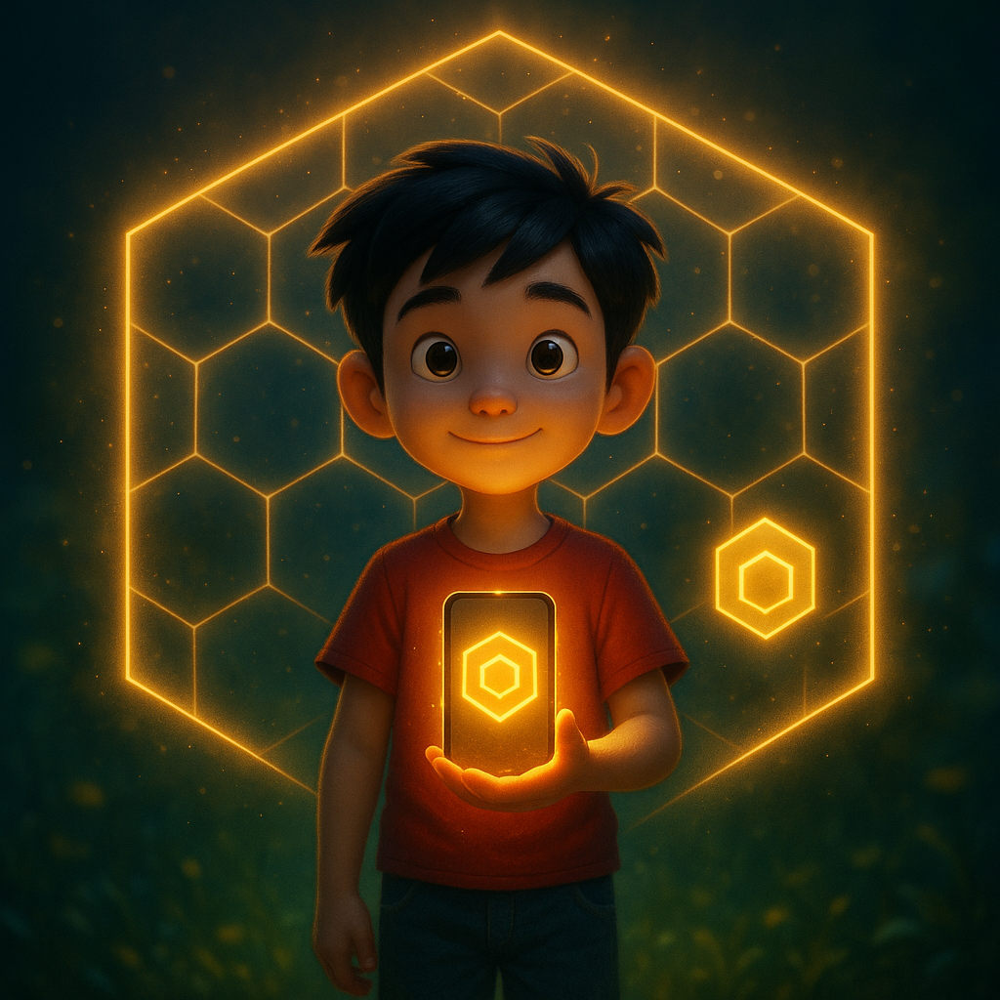
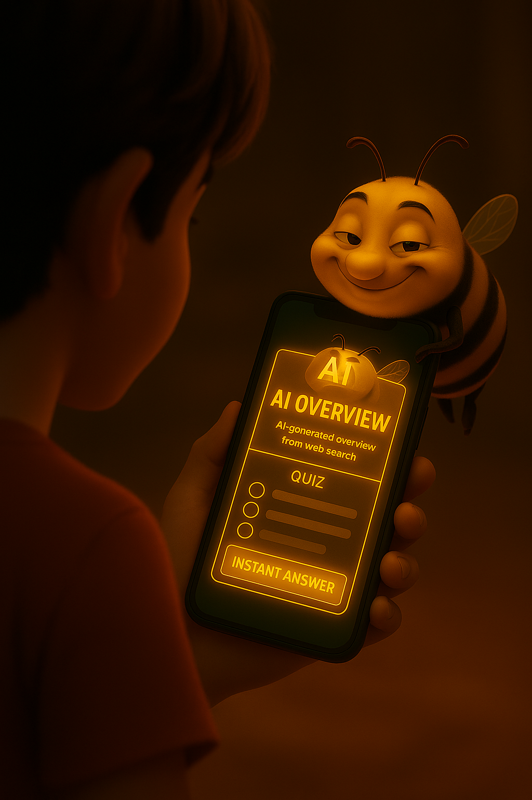

  

 

  <h2>
    <a href="https://www.kikko.be/apk/kikko_saga_forge.apk">
      ⬇️ Download the Android APK ⬇️
    </a>
  </h2>
  <strong>( https://www.kikko.be/model/kikko.apk )</strong>

# Kikko's Saga Forge: A Verifiable & Evolvable Knowledge RPG

**"Forge your verifiable saga with an on-device AI. A new game to combat digital amnesia and restore trust in AI."**

---

### **1. The Vision: An Answer to the AI Trust Crisis**

This document serves as the technical verification for our submission to the Google Gemma 3n Impact Challenge. It details the architecture of Kikko's Saga Forge, a novel **"Verifiable & Evolvable Knowledge Game"** designed as a 100% on-device, privacy-first Android application. We explain our specific and multifaceted use of the Gemma 3n model, highlight the significant engineering challenges we overcame—particularly in ensuring AI robustness and system resilience—and justify the technical choices that make our vision a functional reality. This document proves that our video demonstration is backed by deliberate, concrete engineering.

*   [**Document 10: Synopsis for the Google Competition**](./doc/doc10.md)

| The Dilemma | The Process | The Reward |
| :---: | :---: | :---: |
|  |  |  |
| **Individual Sovereignty:** Kikko gives each user full control over their digital memory, securing it on their device and making it verifiable. | **The Conscious Choice:** The main gameplay loop is a continuous test where the user chooses authentic, personally forged knowledge over convenient but opaque external data. | **The Living Saga:** The ultimate reward is a companion who understands and protects you, a testament to your own journey of discovery. |

---

### **2. The Hive's Architecture: A Guild of On-Device Agents**

Our core architectural philosophy is a **decentralized guild of specialized AI agents**, rather than a monolithic system. This ensures modularity, efficiency, and robustness, all while operating entirely offline on the user's device. This ecosystem is populated with AI models and content decks downloaded from our central repository at `kikko.be` or sideloaded by the user, ensuring full offline capability after the initial setup.

*   [**Document 04: The Role of the AIs**](./doc/doc04.md)

| The Raw Pollen | The Act of Suggestion & Request | The Seal of Trust |
| :---: | :---: | :---: |
|  |  |  |
| **Initial Extraction:** As raw pollen enters the Hive, the Worker Bees (ML Kit) begin meticulous on-device processing. | **Human-AI Partnership:** The AI Queen (Gemma) uses her knowledge to create her best hypothesis and presents it to the user for validation and to gather more human context. | **The Forged Knowledge:** If the user chooses authenticity, the AI Queen forges verifiable knowledge, culminating in a pristine "Seal of Trust". |

---

### **3. The Queen's Role: Our Specific Use of Gemma 3n**

Gemma 3n is not just a feature in our app; it is the **central nervous system** of our AI Guild, acting as the versatile "AI Queen" in several distinct roles. Our implementation (`ForgeLlmHelper.kt`) leverages the MediaPipe LLM Inference API to harness its power. It acts as the **Chief Synthesizer**, **Master Artisan**, **Competing Champion**, **Context-Aware Partner**, and **Impartial Judge**.

*   [**Document 04: The Role of the AIs**](./doc/doc04.md)

| The Synthesis | The Partnership | The Judgment |
| :---: | :---: | :---: |
|  |  |  |
| **The Chief Synthesizer:** The Queen receives raw information from her workers and analyzes it with critical focus. | **The Trusted Search:** The AI Queen performs a deep search across the verified personal knowledge graph, ensuring data purity and integrating human context. | **The Saga Clash:** In the Arena, the players' knowledge is tested in a friendly and mutually beneficial card battle, arbitrated by the Queen. |

---

### **4. Challenges Overcome: Forging Trust and Robustness**

Building a reliable on-device AI system presented four major challenges, which we solved with specific architectural innovations, including advanced prompt engineering, an error remediation loop, and our key innovation: the **"Thread of Provenance"**.

*   [**Document 06: The Thread of Provenance**](./doc/doc06.md)

| The Private Vault | The Unbreakable Seal | The Sovereign Gift |
| :---: | :---: | :---: |
|  |  |  |
| **100% On-Device:** The user's saga is securely stored within their own personal, on-device ecosystem. | **Radical Transparency:** The user can inspect the "Thread of Provenance," revealing the complete journey of data creation, from raw input to final structure. | **The Global Swarm:** These trusted exchanges form resilient, decentralized constellations of knowledge. |

---

### **5. Acknowledgments & Development Methodology: The Hornet Council**

This project was developed by a single human architect, assisted by a council of specialized AI agents, or "Hornets": Gemini, ChatGPT, Grok, Claude, Mistral, and Deepseek. Our development process mirrored the app's own philosophy: the human acted as the "Hive Master," orchestrating the AI guild via a foundational "Hornet Council" initialization prompt. This multi-agent team was tasked with brainstorming, code generation, debugging, strategic analysis, and documentation drafting.

All still images for our documentation and the characters in our video were generated using ChatGPT-4o's DALL-E 3 engine. The video animations themselves were produced using Google's Veo.

Kikko's Saga Forge is therefore a testament to a new era of human-AI co-creation, where a single developer, acting as an orchestrator, can forge a complex and polished product by leveraging a swarm of specialized intelligences.

### **6. Future Work & Vision: The Self-Learning Hive**

Our current implementation lays a robust foundation. Our vision for the future transforms Kikko from a tool into a truly intelligent partner that learns and grows *with* the user.

*   **Self-Expanding On-Device Knowledge Base:** We will empower the Forge to build its own internal knowledge graph.
*   **Dynamic & Self-Learning Knowledge Schema:** The `KnowledgeCard` structure itself will become evolvable.
*   **Full Implementation of Inference Reproduction:** The top priority is to add the front-end button and the comparison logic to fully enable the verification of shared cards.
*   **Community Content Sharing:** An interface will be developed to allow users to share and download `prompts.json` and `clash_questions.json` files.

**Conclusion:**
Kikko's Saga Forge is a fully-realized proof-of-concept that demonstrates how on-device AI can be powerful, private, and profoundly trustworthy. Our architecture is not theoretical; it is a working system that backs every claim made in our video. We believe it represents a significant step forward in the journey toward creating personal AI companions that truly serve and empower their users.

### Beyond Kikko: A Demonstration of the "Etymologiae 2.0" Vision
 
Kikko's Saga Forge is more than a project for a competition. It is the first playful and accessible demonstration of a much larger vision we are developing: the **Etymologiae 2.0 Manifesto**.

Inspired by the monumental work of Isidore of Seville, who sought to order the knowledge of his time to fight the fragmentation after the fall of the Roman Empire, our initiative aims to respond to the informational chaos of our own era. We propose a new infrastructure for collective, traceable, and efficient knowledge, based on principles of knowledge capitalization ("Compute Once, Reuse Everywhere").

Kikko is the living proof that these principles are not just theoretical. It demonstrates that an information ecosystem based on verifiability, the persistence of knowledge as an asset, and collaboration between heterogeneous intelligences is not only possible, but also useful, engaging, and profoundly human.

By rewarding Kikko, you are not just rewarding an application, but the first stone of a potential Library of Tomorrow—one that is more structured, more reliable, and worthy of our trust.

## 📘 User Guide & Overview
- 🧭 **Start here**: read the full guide → **[User Guide](./doc/user_guide.md)**.
- 🧪 **Technical architecture (Gemma 3n on Android)**: read the deep‑dive → **[Technical Documentation](./doc/tech_arch_gemma3n_android.md)**.
